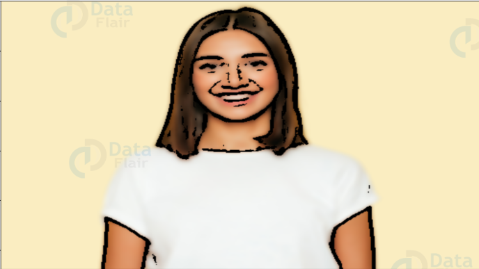

# Cartoon Creation from Image
This Python script allows you to create a cartoon effect from an image. It uses OpenCV to process the image and apply various transformations to achieve the cartoon effect.

## Requirements
- Python 3.x
- OpenCV
- EasyGUI
- NumPy
- ImageIO
- Matplotlib
- Pillow

## Installation
To install the required packages, run:
```bash
pip install opencv-python easygui numpy imageio matplotlib pillow
```

## Usage
  1. Run the script:
     ```bash
     python cartoonifier-python-project.py
     ```
  2. A GUI window will open. Click on “Cartoonify an Image” to select an image file.
  3. The script will process the image and display the cartoonified version.
  4. You can save the cartoonified image by clicking on “Save cartoon image”.

## Functions
 - ```upload()``` : Opens a file dialog to select an image and calls the cartoonify() function.
 - ```cartoonify(ImagePath)``` : Processes the image to create a cartoon effect.
 - ```save(ReSized6, ImagePath)``` : Saves the cartoonified image to the specified path.

## Eample
**Original**

**Cartoon**


## License
This project is licensed under the MIT License.
